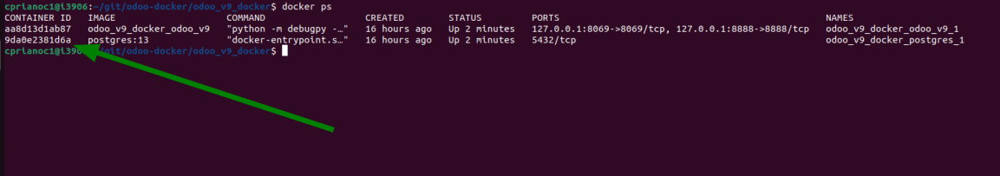
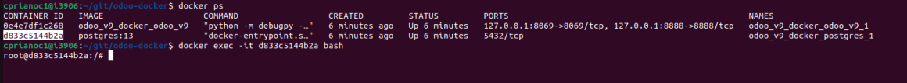
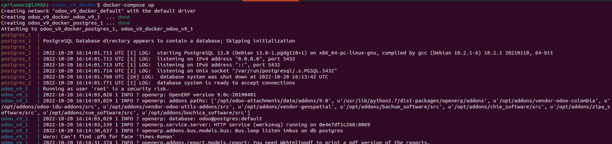
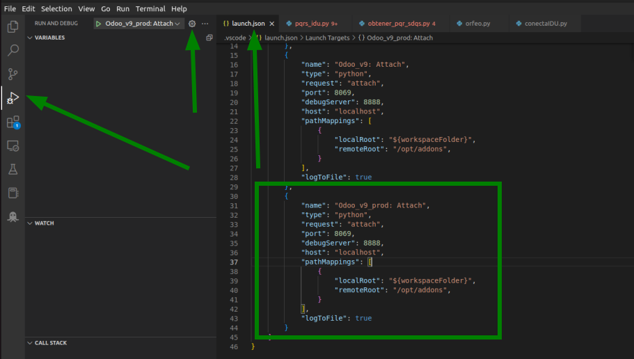

# Configuración y puesta en funcionamiento Odoo V9 en Docker

## DOCKER

Para empezar se debe hacer pull de este repositorio:
>git clone http://172.16.3.21/cprianoc1/odoo-docker.git

O por ssh como prefieran, dentro de la carpeta de odoo hay una carpeta llamada ´addons´ donde están los repositorios necesarios, pero es bueno que les hagan pull a los repositorios que mas actulizaciones se les hacen como odoo-idu-addons, bachue_software...

Después de hacer pull en los repositorios necesarios, se debe descargar el backup de la BD de odoo_v9 a la carpeta de db_postgresql, en este momento el más actualizado es (esto para no subir un archivo de mas de 2GB al git):

>scp "openerp@oe02cc01:/opt/odoo-attachments/backups_oe01cc01/odoo_v9-202210191315.bak" db_postgresql/

**Importante** Si hacen ajustes y van a hacer push, no incluir este archivo .bak

ingresan a la carpeta de odoo_v9_docker y ejecutan:
>docker-compose up

Si en alguno de los pasos sale un error de permisos, ejecuten los comandos con **sudo**.

### Video tutorial (pendiente):

Una vez estén creados y ejecutandose los contenedores, entrar al contenedor de postgresql y ejecutar las siguientes lineas requeridas para restaurar la BD y configurarla para que no queden tareas atuomatizadas activas (esto es muy importante porque algunas crean registros en sistemas alternos de producción):

Para ingresar al contenedor de postgresql ejecutan ´docker ps´ para obtener el id del contenedor

Con el id del contenedor ejecutan:
>docker exec -it 9da0e2381d6a bash

Una vez dentro del contenedor ejecutan lo siguiente:

>
>
> createdb -U odoo odoo_v9
>
> psql odoo_v9 -U odoo -c 'CREATE EXTENSION postgis;CREATE EXTENSION postgis_topology;
>
> psql -f  odoo_v9
>
> pg_restore -Fc -d odooV9 /var/lib/db_postgresql/odoo_v9-202210191315.bak -O -U odoo
>
>psql odoo_v9 -U odoo -c "UPDATE res_users SET password_crypt = '\$pbkdf2-sha512\$6400\$nPM.p/S.9z5HqNV6z5mT8g\$j2g9YBCVmVxjyhIP8unpKFYDK6ZknKOvKK435j6Nsy0md8v8K0DpOtM9V1q1ISIhfBy0uN9BeDWbPWGGlcS3fg';"
>
>psql odoo_v9 -U odoo -c "UPDATE ir_cron SET active=FALSE;"
>
>psql odoo_v9 -U odoo -c "UPDATE ir_mail_server SET smtp_port=1025;"
>
>psql odoo_v9 -U odoo -c "DELETE FROM ir_config_parameter WHERE key LIKE 'website.recaptcha.%';"

salen del contenedor de postgresql y reinician los dos contenedores con

> Ctrl+C

o

> docker-compose stop

y

> docker-compose up

## VISUAL STUDIO CODE

Desde un terminal abren la carpeta del contenedor y abren la carpeta de addons con el visual studio code:

> code addons

Deben tener instalada la extensión de python para poder hacer debug.
Según la documentación de vsc [documentación de vsc](https://code.visualstudio.com/docs/python/debugging#_remote-script-debugging-with-ssh).

>
 {
  "name": "Python: Attach",
  "type": "python",
  "request": "attach",
  "port": 5678,
  "host": "localhost",
  "pathMappings": [
    {
      "localRoot": "${workspaceFolder}", // Maps C:\Users\user1\project1
      "remoteRoot": "." // To current working directory ~/project1
    }
  ]
}

Como ejemplo:

>
{
    "name": "Odoo_v9: Attach",
    "type": "python",
    "request": "attach",
    "port": 8069,           // Puerto de Odoo
    "debugServer": 8888,    // Puerto de la librería debugpy
    "host": "localhost",
    "pathMappings": [
        {
            "localRoot": "${workspaceFolder}",
            "remoteRoot": "/opt/addons",        // Ruta donde están los módulos dentro del contenedor
        }
    ],
    "logToFile": true
}

Esta librería ya se está instalando y ejecutando en el contenedor de Odoo, les recomiendo revisar el archivo de docker-compose.yml y los Dockerfile de los Odoo_v9 y de postgres (este está en construcción para automatizar la creación y configuración de la BD)
